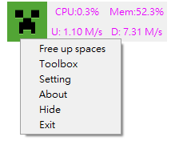
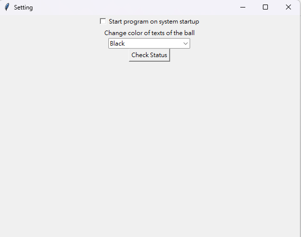
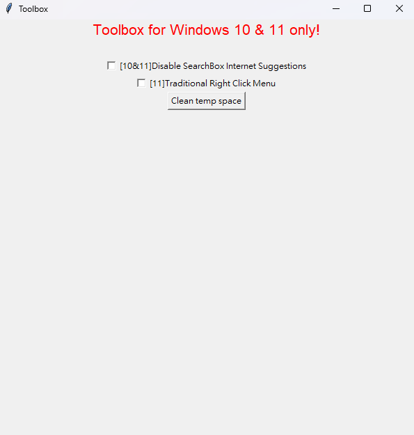

# A-Speed-Ball

## What is this?
A program just like a small menu showing CPU percentage, Memory Percentage, Uploads and Downloads by Python

I am a new hand so don't blame at me (0.0)

## How I achieve the function
- tkinter
  - GUI
- psutil
  - getting CPU/MEM/UPL/DOW
- threading
  - Avoid "Not Responding"

## Structure

A-Speed_ball  
|  
|------ images  
|  
|------code  
         |  
         |------ball.py  main file  
         |  
         |------engine.py for getting CPU and managing setting  
         |  
         |------creeper.png for creeper icon :)  
         |  
         |------setting.setting for storing setting  

#FAQ

## I don't like orange color!
You can change the color of texts in setting

## Only Showing these? So boring
I know, so I am making some cool function like rainbow color for the text in setting and a toolbox is made for more function

More functiion will be added

## How can I install it?
Just get to the path of program in cmd and type these 2 codes:
`pip install Pyinstaller`
and 
`Pyinstaller -F ball.py`

